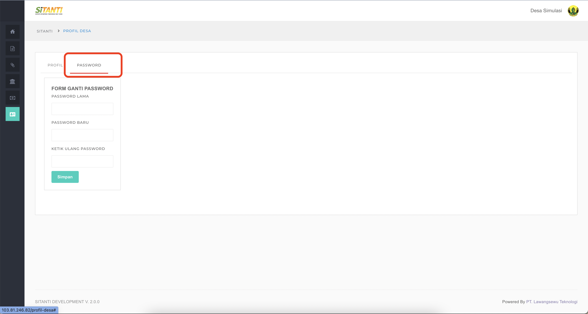

# Perubahan Password

## Panduan Untuk Perubahan Password

### 1.Pilih dan klik Menu **Profil Desa**  

### 2. Pilih dan Klik Tab Tombol **Password**

### 3. Silahkan isi **Password Lama** dan **Password Baru** serta **Ketik Ulang Password Baru** 

### 4. Silahkan Pilih dan Klik Tombol **Simpan** untuk menyimpan passwod

