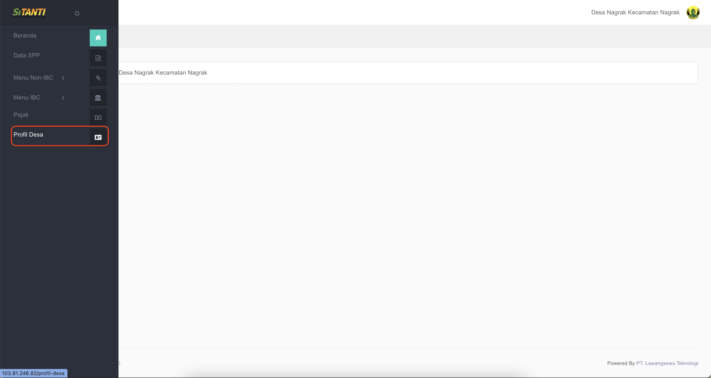
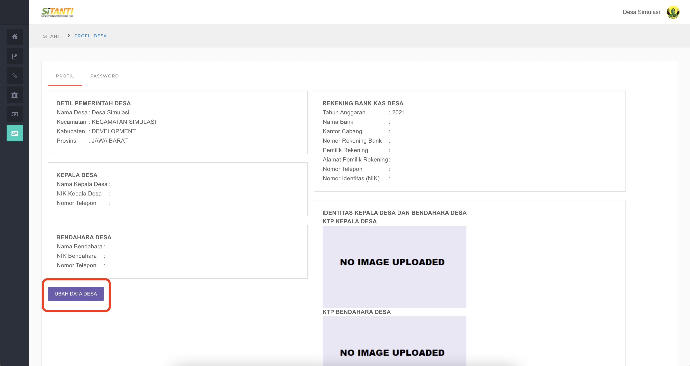
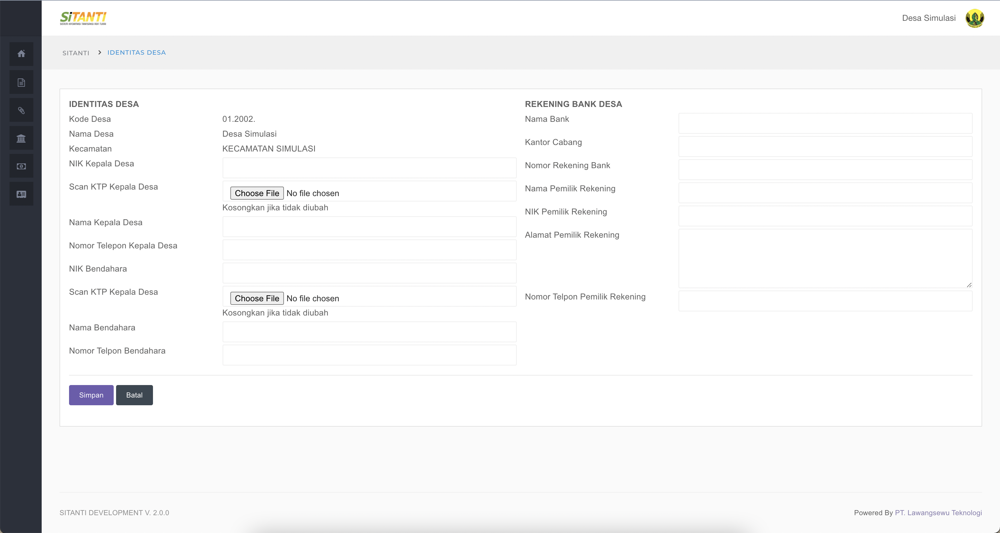

# Update Data Desa

### Untuk Update Data Profil Desa silahkan ikuti langkah berikut ini

1.Pilih dan klik Menu **Profil Desa**  

2. Pilih dan Klik Tombol _**Ubah data Desa**_

3. isi Data Secara Lengkap dan untuk _**Format File KTP Kepala Desa**_ dan _**Bendahara Desa**_ adalah _**jpeg**_

4. Apabila Telah Terisi Secara Lengkap Silahkan Pilih dan Klik Tombol **Simpan**

