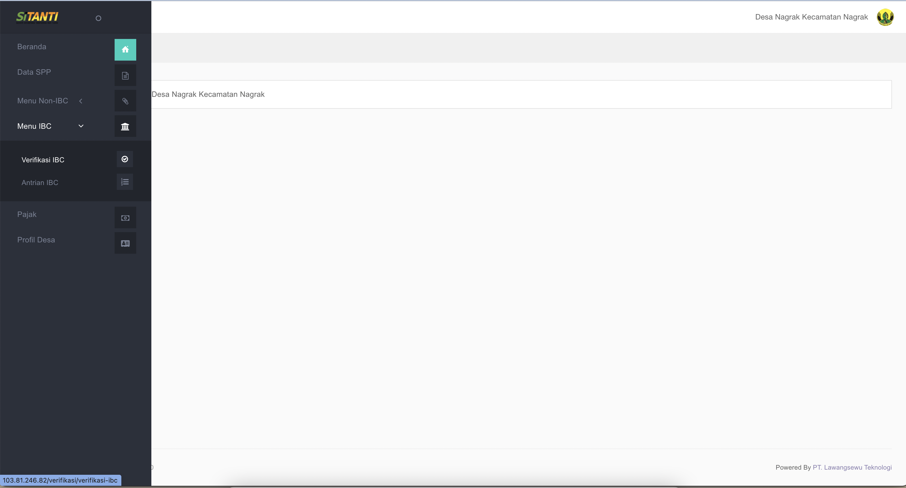

# Transaksi dengan Metode IBC

## Catatan Khusus di Aplikasi Siskeudes

1. SPP yang digunakan dalam Aplikasi Siskeudes adalah SPP Definitif
2. Data Transaksi akan tersinkronisasi otomatis dari Data Siskeudes ke Sitanti Setiap 2 Menit.
3. Dalam Pengisian Data Kwitansi di Siskeudes harap dan wajib di isi untuk : 

* **Nama** = **Nama Penerima** / **Sesuai di Rekening**, 
* **Alamat** = **Sesuai Alamat Penerima**, 
* **Kode Bank = 110 Untuk Bank bjb, No Rek Bank = di isi hanya angka / no rek bank,** 
* **Nama Bank = di isi nama bank ,** 
* **NPWP = di isi no NPWP penerima / NPWP Desa**

   4. Untuk Metode Pencairan SPP menggunakan Metode Pencairan Bank seperti gambar di bawah ini 

## Step by Step Pada Aplikasi Sitanti

    1. Pilih dan Klik **Menu IBC** Kemudian pilih **Verifikasi IBC**

    2. Pilih SPP yang Akan di Verifikasi Kemudian Pilih dan Klik Tombol **Verifikasi**  ****

## Step By Step Pada Aplikasi IBC

