# Transaksi Dengan Metode IBC

## Catatan Khusus di Aplikasi Siskeudes

1. SPP yang digunakan dalam Aplikasi Siskeudes adalah SPP Definitif
2. Data Transaksi akan tersinkronisasi otomatis dari Data Siskeudes ke Sitanti Setiap 2 Menit.
3. Dalam Pengisian Data Kwitansi di Siskeudes harap dan wajib di isi untuk : 

* **Nama** = **Nama Penerima** / **Sesuai di Rekening**, 
* **Alamat** = **Sesuai Alamat Penerima**, 
* **Kode Bank = 110 Untuk Bank bjb,** 
* **No Rek Bank = di isi hanya angka / no rek bank,** 
* **Nama Bank = di isi nama bank ,** 
* **NPWP = di isi no NPWP penerima / NPWP Desa**

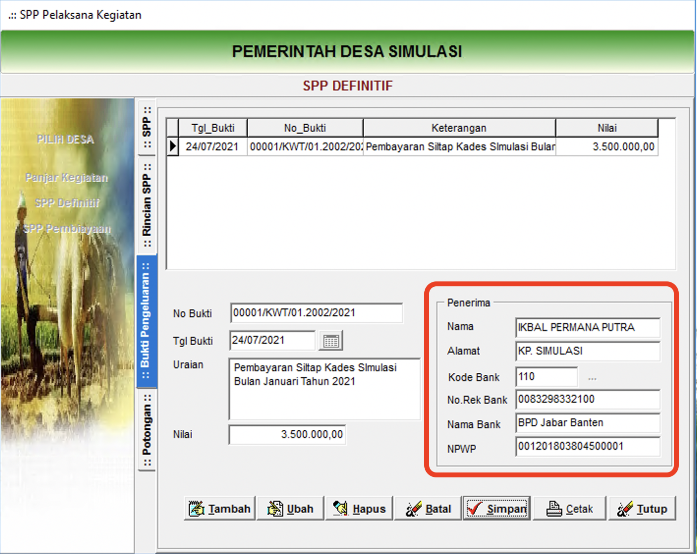

   4. Untuk Metode Pencairan SPP menggunakan Metode Pencairan Bank seperti gambar di bawah ini 

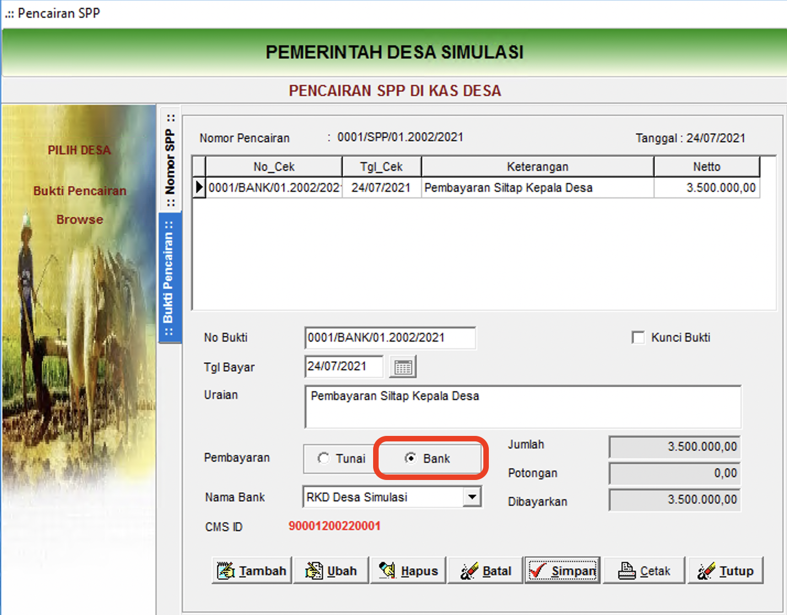

## Step by Step Pada Aplikasi Sitanti

### 1. Pilih dan Klik **Menu IBC** Kemudian Pilih dan Klik **Verifikasi IBC**

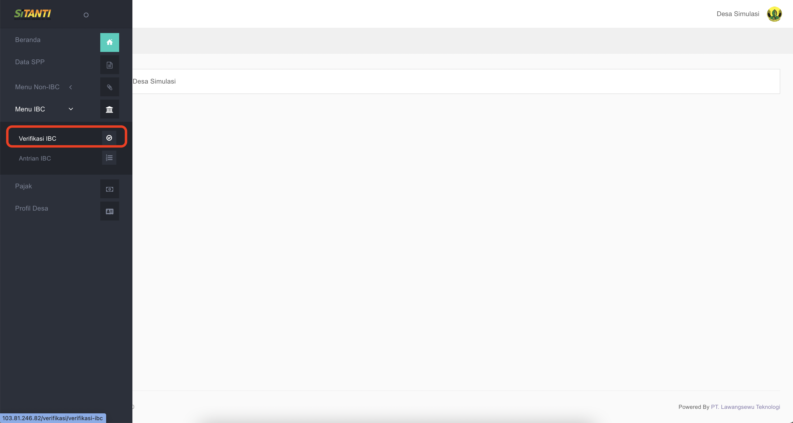

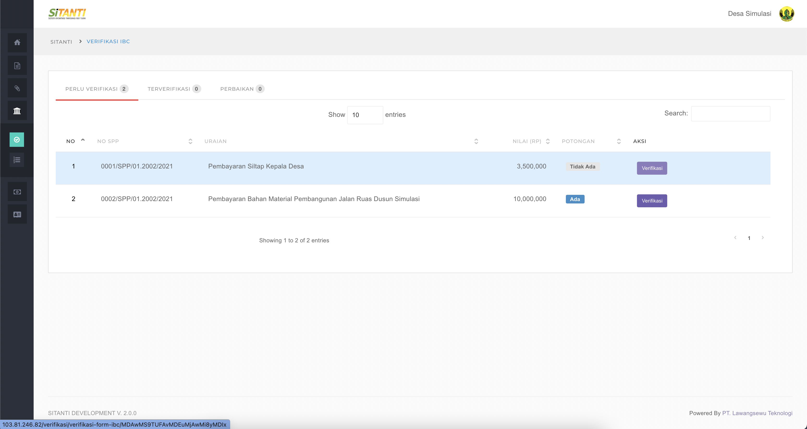

* **Penjelasan** 
  * **No** = No Urut
  * **No SPP** = No SPP Sesuai Register di Aplikasi Siskeudes
  * **Uraian** = Uraian sebagaimana di input di Aplikasi Siskeudes
  * **Nilai \(Rp\)** = Nilai Total Transaksi SPP
  * **Potongan -&gt; Ada** = Terdapat Potongan Pajak
  * **Potongan -&gt; Tidak ada** = Tidak terdapat Potongan Pajak
  * **Aksi Tombol Verifikasi** = Tombol Untuk Verifikasi SPP

### 2. Pilih SPP yang Akan di Verifikasi Kemudian Pilih dan Klik Tombol **Verifikasi**  ****

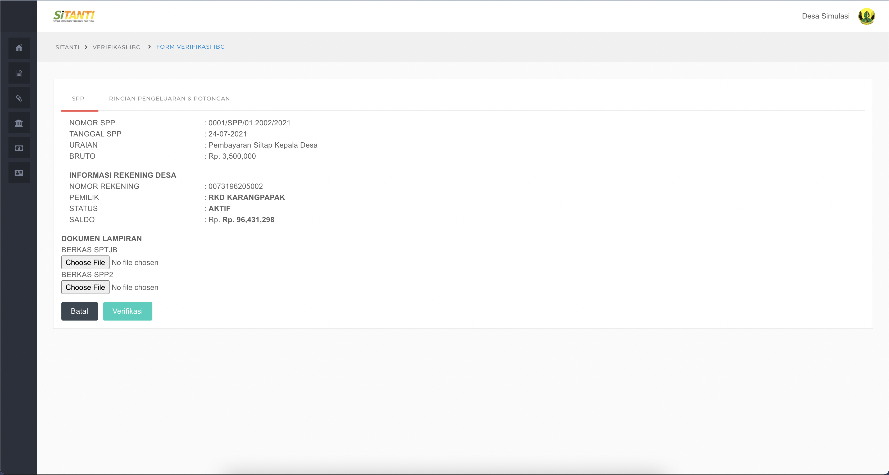

* **Penjelasan Tab  SPP** 

  * **Nomor SPP** = No SPP Sesuai Register di Aplikasi Siskeudes
  * **Tanggal SPP** = Tanggal Pembuatan SPP di Aplikasi Siskeudes
  * **Uraian** = Uraian yang di input di Aplikasi Siskeudes
  * **Nilai \(Rp\)** = Nilai Total Transaksi SPP

  \*\*\*\*

* **Dokumen Lampiran** 

  * **Nomor Rekening** = Nomor Rekening Kas Desa
  * **Pemilik** = Nama Rekening
  * **Status** = Status Rekening
  * **Saldo** = Saldo \(Realtime\) di Rekening Kas Desa

  \*\*\*\*

* **Dokumen Lampiran** 
  * **Berkas SPTJB** = Untuk Mengupload File SPTJB yang di prinout dari Aplikasi Siskeudes dan Sudah di Tandatangani **\(File Format PDF\)**
  * **Berkas SPP2** = Untuk Mengupload File SPP2 yang di printout dari Aplikasi Siskeudes dan Sudah di Tandatangani dan di Cap Basah **\(File Format PDF\)**

### 3. Pilih Menu Tab Rincian Pengeluaran & Potongan

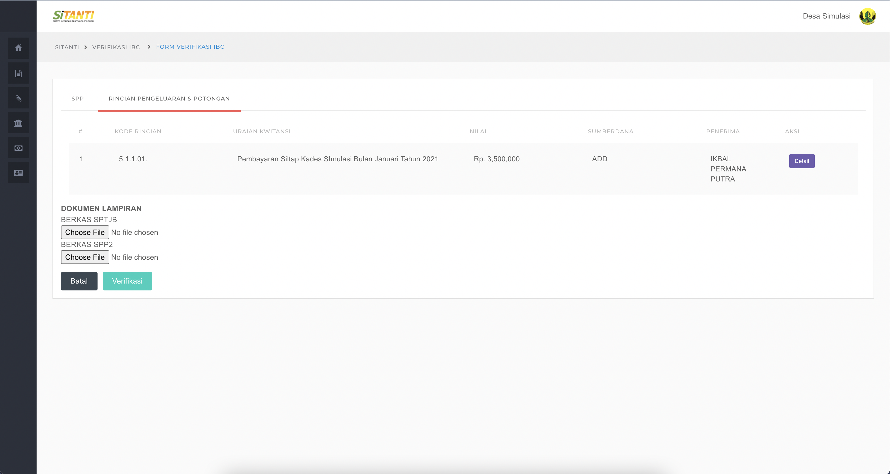

### 4. Pilih dan Klik Detail

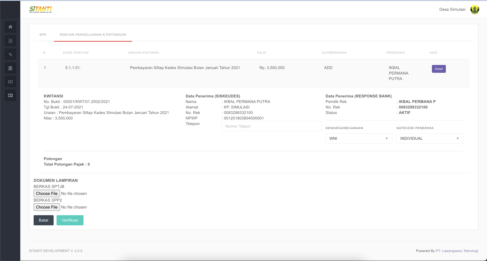

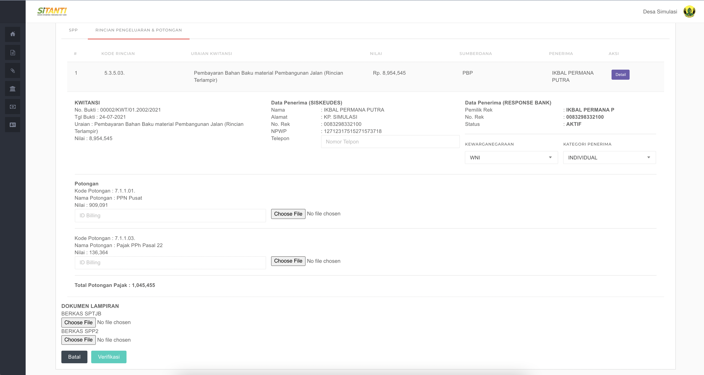

* **Penjelasan Kwitansi :**  

  * **Nomor Bukti** = No Kwitansi Sesuai Register di Aplikasi Siskeudes
  * **Tanggal Bukti** = Tanggal Kwitansi di Aplikasi Siskeudes
  * **Uraian** = Uraian Kwitansi sebagaimana di input di Aplikasi Siskeudes
  * **Nilai \(Rp\)** = Nilai Total Transaksi Pada Kwitansi **\(Netto / setelah di kurangi pajak apabila ada potongan pajak\)**

  \*\*\*\*

* **Penjelasan Data Penerima \(Siskeudes\) :**  

  * **Nama** = Nama Penerima yang di input di Aplikasi Siskeudes
  * **Alamat** = Alamat Penerima yang di input Aplikasi Siskeudes
  * **No Rek** = Nomor Rekening yang di input di Aplikasi Siskeudes
  * **NPWP** = Nomor NPWP yang di Input di Aplikasi Siskeudes
  * **Telepon** = Silahkan Isi nomor Telepon Penerima

* **Penjelasan Data Penerima \(RESPONSE BANK\) :**  

  * **Pemilik Rek** = Nama Pemilik Rekening Sebagaimana terdaftar di Bank
  * **No Rek** = Nomor Rekening 
  * **Status** = Status Keaktifan Rekening
  * **Kewarganegaraan** = Silahkan Pilih Kewarganegaraan Pemilik Rekening Penerima
  * **Kategori Penerima** = Silahkan Pilih Kategori Pemilik Rekening Penerima

* **Potongan :**  

  * **Kode Potongan** = Kode Potongan Pajak di Aplikasi Siskeudes
  * **Nama Potongan** = Jenis Potongan Pajak
  * **Nilai** = Nilai Potongan Pajak
  * **ID Billing** = Silahkan Input ID BIling Pajak **\(Tanpa Spasi\)**
  * **Choose File** = Silahkan Pilih File Billing Pajak **\(Format PDF\)**

  \*\*\*\*

* **Dokumen Lampiran** 
  * **Berkas SPTJB** = Untuk Mengupload File SPTJB yang di prinout dari Aplikasi Siskeudes dan Sudah di Tandatangani **\(File Format PDF\)**
  * **Berkas SPP2** = Untuk Mengupload File SPP2 yang di printout dari Aplikasi Siskeudes dan Sudah di Tandatangani dan di Cap Basah **\(File Format PDF\)**

### 5. Setelah Data Sesuai dan Lengkap Silahkan Pilih Tombol Verifikasi Untuk Melanjutkan atau Pilih Tombol Batal Apabila Ingin Membatalkan Verifikasi

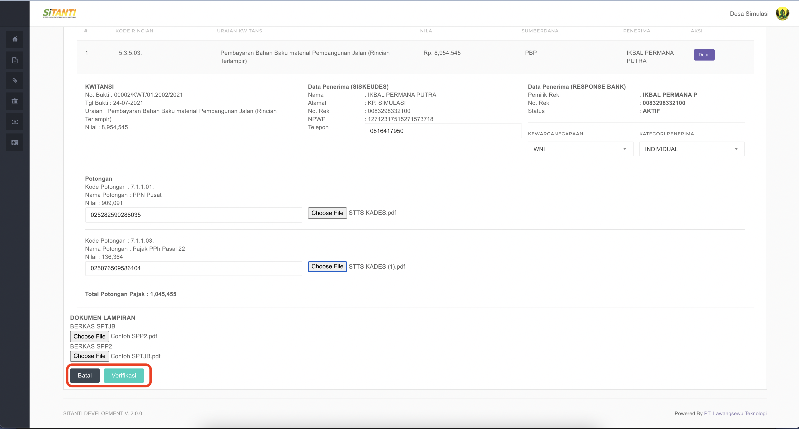

### 6. Notifikasi Data Berhasil Di Simpan

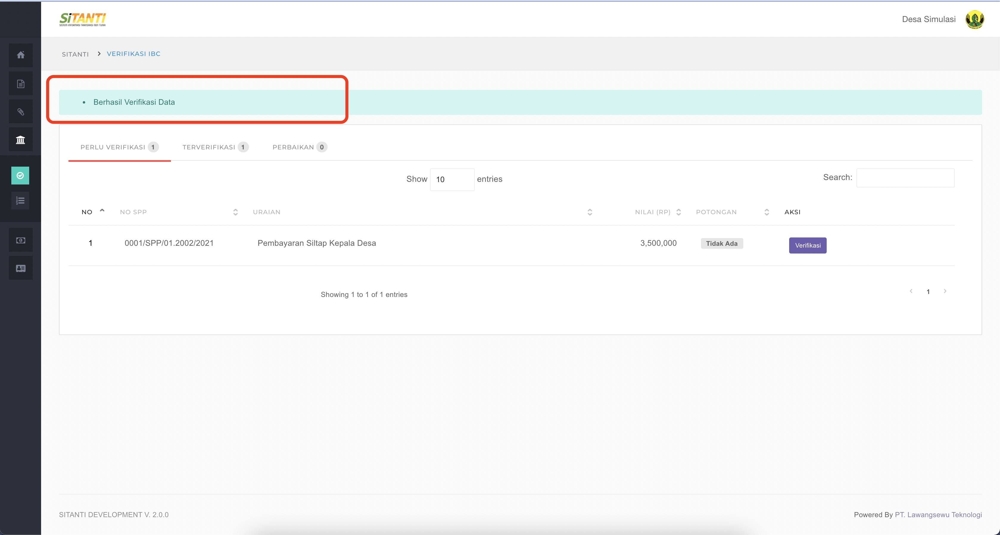

### 7. Pilih dan Klik Menu Verifikasi IBC kemudian Pilih dan Klik Menu Antrian IBC 

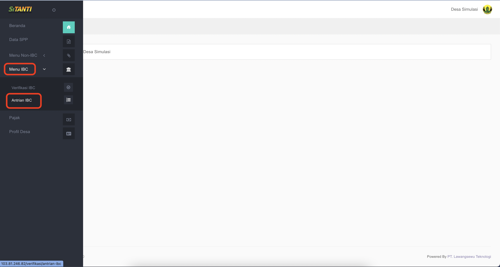

* **Penjelasan Menu Tab** 

  * **Kwitansi Proses** = Daftar Antrian Transaksi /  **KD RELEASE** yang **BELUM CAIR** / **Baru di Verifikasi**
  * **Kwitansi Berhasil DiProses** = Daftar Transaksi / **KD RELEASE** yang telah **CAIR / Berhasil di Proses di IBC**  
  * **Kwitansi Gagal Proses =** Daftar Transaksi / **KD RELEASE** yang **GAGAL** / di **TOLAK di IBC.**

  \*\*\*\*

* **Penjelasan Tabel Antrian** 
  * **Nomor** = Nomor Urut 
  * **KD RELEASE** = Kode Release yang nantinya di input kedalam Aplikasi IBC
  * **No SPP =** Nomor Register SPP di Aplikasi Siskeudes
  * **No Kwitansi** = Nomor Register Kwitansi di Aplikasi Siskeudes
  * **Uraian** = Uraian yang di input di Aplikasi Siskeudes
  * **Nilai** = Nilai Transaksi / Nilai Netto \(Setelah di Kurangi Pajak\)
  * **Potongan** = Potongan Pajak
  * **Tgl Verifikasi** = Tanggal pada Saat Verifikasi di Aplikasi Sitanti

### 8. Silahkan Salin KD RELEASE di sitanti untuk di input di Aplikasi IBC

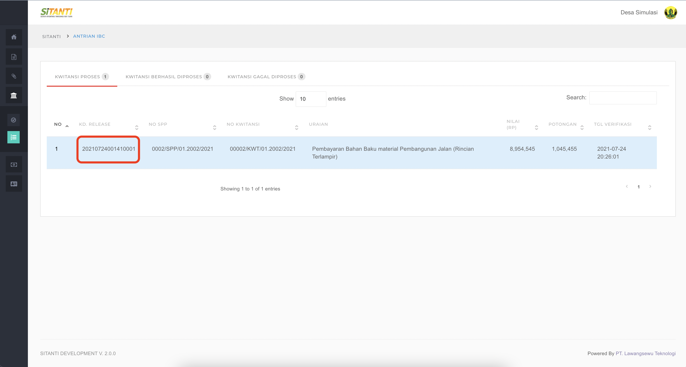

## Step By Step Pada Aplikasi IBC

